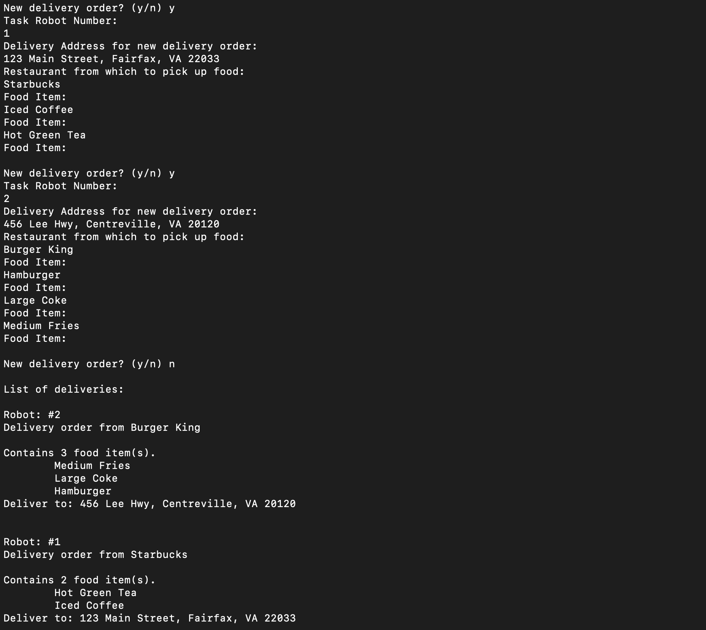

# Ordering-Display-System
Task Overview: 
- Create an ordering and delivery system where a user can place multiple orders at a time and order multiple items in a single order.
- User can assign a robot number and send the order to multiple addresses. 

Sample Run:

